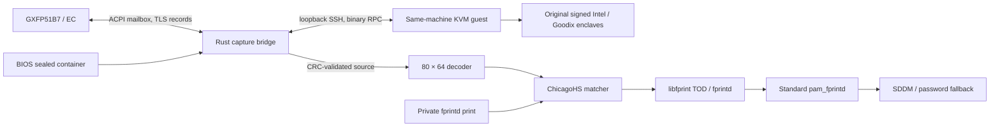

# Architecture and protocol

## Data path

The original enclave unseals the communication key on the same physical SGX
platform. The guest provides the signed enclave's compatible launch environment.

## Hardware and framing

ACPI device `GXFP51B7:00` uses namespace `\_SB.SPBA`. The reserved host mailbox
starts at `0x40200000`, spans `0x8000` bytes and has receive offset `0x1000`.
DSM GUID `cc58b68a-4479-4893-a8bb-961209db59e5`, revision 0, function 1 returns
the sealed container; function 2 rings the EC doorbell. The BIOS helper verifies
the container header, 885-byte length and DMI identity, and exposes mode 0600.

Rust validates the DMI model, ACPI resource and reserved mapping before acquiring
an exclusive root-owned capture lock. The lock name remains compatible with the
commissioned deployment. The guest RPC uses three little-endian 32-bit words:
magic `0x43505247`, operation and length/status. Both directions have bounded
record sizes and capture deadlines. Large mailbox records must remain stable for
30 milliseconds before consumption.

TLS uses the observed TLS 1.2 `PSK-AES128-CBC-SHA256` suite. The host forwards
records and the original enclave performs cryptographic verification. The
256-byte volatile sensor configuration requires acknowledgement `90 / 01 01`
before capture `20 / 01 00`. The enclave's final integrity result and original
component CRC success are required before decoding.

## Image and enrollment

The exported image source is 10560 bytes: 80 column slots of 132 bytes, each
containing 96 packed 12-bit pixel bytes and 36 zero-padding bytes. Four pixels
occupy six bytes. The decoder verifies padding and produces 5120 row-major
pixels. A compact 7680-byte representation supports synthetic tests.

Presence quality measures mean background drop and ridge contrast after upper
row and column medians are removed. Contact requires drop at least 900 and
contrast at least 40. Complete lift requires drop below 300 and contrast below 20.
The initial commissioning background resides in `background.json`; a
background-only NPZ reader supports previously commissioned installations.

The pinned upstream ChicagoHS algorithm supplies calibration, preprocessing,
features, enrollment-position policy and type-24 matching. Enrollment refreshes
the background after confirming an empty sensor and accepts 12 positions, bounded
to 50 attempts and ten minutes. Verification uses upstream selector 207 and
accepts a score greater than zero for one quality-accepted capture. The stored
gallery remains fixed during verification.

## Libraries and boundaries

`gxfp-core` supplies decoding, quality and background compatibility I/O.
`gxfp-backends` exclusively wraps ChicagoHS native state. `gxfp51b7` supplies
transport, account checks, calibration, installation and commissioning.

| Library | Responsibility |
| --- | --- |
| ndarray | Image arrays and quality computation |
| ndarray-npy | Background-only migration reader |
| clap, serde, serde_json | Commands, configuration and private print encoding |
| nix, memmap2, wait-timeout | Privileges, volatile mapping and subprocess deadlines |
| tempfile, sha2 | Atomic private writes and commissioning digests |
| GLib/GIO, libfprint TOD | Native algorithm glue and fingerprint device API |
| fprintd, Linux-PAM | Standard print storage, authorization and login integration |

The small C TOD adapter bridges the libfprint device API to a root Rust worker.
Only bounded progress events and private print bytes travel through inherited
pipes. Malformed events, embedded NULs, invalid stage order, oversized prints and
truncated streams terminate the operation. Cancellation terminates the worker
process group. Adapter limits are 30 seconds for verification and 660 seconds for
enrollment, including cleanup allowance.

The real EC sensor is discovered through the fixed environment value
`FP_GXFP51B7_DEVICE=/dev/goodix_bios_sealed`. This uses libfprint's virtual discovery
entry because its native udev paths cover USB, spidev and hidraw. Every capture
still validates the actual machine and ACPI device. The SGX guest ABI, share tag
and previously commissioned private paths retain their functional compatibility.

## Authentication and commissioning

The worker checks the root-owned enabled configuration, exact local username/UID
and unlocked account password. The standard PAM module used by commissioning
must match the module selected for SDDM. Commissioning checks an empty sensor,
the enrolled finger and three different fingers. Its digest binds configuration,
background, executable, adapter, PAM module, probes and fprintd prints.

SDDM shell, nologin, environment and faillock checks precede the fingerprint
branch. A successful fingerprint invokes `pam_faillock authsucc`; a failed branch
continues to the original password path and normal account/session includes.

The QEMU service uses a dedicated non-root account, restricted devices and a
read-only vendor share. SSH pins the guest host key and uses a dedicated identity.
Root helpers and the fprintd service disable core dumps. The trusted computing
base includes host root, the reviewed guest and ChicagoHS. See
[security scope](../SECURITY.md) and [validation](VALIDATION.md).
