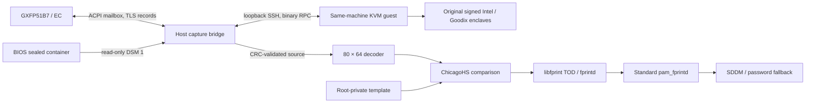

# Architecture and protocol

## Data path

The communication key is unsealed inside the original vendor enclave. SGX hardware keys bind unsealing to the same physical platform. The guest provides the compatibility environment for the signed legacy enclave and Intel launch flow.

## Hardware boundary

- ACPI device: `GXFP51B7:00`, namespace `\_SB.SPBA`.
- Reserved host mailbox: `0x40200000`, size `0x8000`, receive offset `0x1000`.
- DSM GUID: `cc58b68a-4479-4893-a8bb-961209db59e5`, revision 0.
- DSM 1 provides a 2048-byte buffer declaring an 885-byte sealed container. The host helper accepts only the validated container header and DMI model; its device mode is 0600.
- DSM 2 rings the EC doorbell through `acpi_call`.
- Sensor register ID: `0x2504`, ChicagoHS enumeration 12. The empty `0x90` response `e0 e1` is recorded as a separate query response.

The host transport checks DMI, ACPI presence, reserved resource bounds and exclusive access. Exclusive capture requires the diagnostic driver to be unloaded. The lock protects overlapping capture processes.

TLS uses the observed TLS 1.2 `PSK-AES128-CBC-SHA256` suite. The host forwards records; the original enclave performs cryptographic verification. After the handshake, the bridge submits the validated volatile 256-byte sensor configuration, requires acknowledgement `90 / 01 01`, then submits capture `20 / 01 00`. The configuration applies to the current capture session; firmware and persistent key state remain as provisioned.

The guest RPC header is three little-endian 32-bit words: magic `0x43505247`, operation and length/status. The bridge bounds record sizes, observes the handshake completion status and accepts the source only after the original component's CRC success and expected final plaintext length. Large mailbox records must be stable for 30 ms before being consumed.

## Image and affine comparison

The CRC-validated plaintext has length 10573 bytes; exported source is 10560 bytes. Image source is 80 column slots of 132 bytes: 96 bytes of packed 12-bit pixels plus 36 zero-padding bytes. Four pixels occupy six bytes. The decoder validates zero padding and produces 5120 row-major pixels. A separate tightly packed 7680-byte representation is supported for offline analysis only.

The matcher subtracts each capture from its enrollment background, applies Gaussian filters with sigma 0.7 and 2, subtracts those results and crops four pixels per edge to obtain 56×72 values. Presence gates require mean drop at least 900 and ridge contrast at least 40. Matching requires overlap at least 1600 pixels and normalized correlation at least 0.86.

Reference rotations cover −24° through +24° in 3° increments. The three highest-scoring references are refined with angle offsets ±2° at 1° steps, axis scales `{0.94, 0.97, 1, 1.03, 1.06}` and shear `{−0.03, 0, 0.03}`. Translation is bounded to ±30 horizontal and ±24 vertical pixels. Transformed-image masks exclude interpolated padding. The Rust implementation preserves this policy and NPZ representation. Synthetic parity tests compare its decoder, Gaussian filtering, quality gates, affine sampling and complete search against the Python reference.

## Privileges and authentication

The host PAM helper runs as root because it accesses the protected mailbox, sealed container and template. It accepts only the explicit PAM `user=` account, executes the fixed Rust helper with a sanitized environment, suppresses capture output, disables core dumps and bounds the subprocess group to 15 seconds. Nonzero exits, signals and timeouts return authentication unavailable; the PAM configuration continues to the original password path.

The Rust helper requires root-owned non-writable paths, a matching local username/UID, a finite template of the expected shape and the fixed v3 policy/threshold. Root, empty-password and password-locked accounts are rejected. SDDM account/password/session includes remain in place. Shell, nologin, environment and faillock prechecks precede the optional fingerprint branch. A successful fingerprint goes through `pam_faillock authsucc`; the one-module failure jump avoids relying on the expanded length of a PAM include.

QEMU runs as the dedicated non-root `gxfpvm` account. Its service uses an empty capability set, a read-only vendor share and restricted user networking through a loopback SSH port. Its service restricts device access to KVM and virtual EPC, protects the host filesystem and disables core dumps. The SSH client authenticates with its dedicated private key and pins the guest host identity.

The trusted computing base includes host root, the administrator-provided guest and the custom matcher. A forged fingerprint satisfying that matcher can be accepted. See [security scope](../SECURITY.md).

## Rust components and library boundaries

The Cargo workspace has four packages. `gxfp-backends` wraps the pinned native
ChicagoHS matcher and provides an OpenCV RootSIFT research comparator. `gxfp-core` handles decoding, image
preparation, matching and template I/O. `gxfp51b7` provides device transport,
account checks, enrollment, commissioning, installation and VM lifecycle commands.
`pam-gxfp51b7` builds a `cdylib` with Linux-PAM entrypoints through `pam-bindings`.

| Library | Responsibility |
| --- | --- |
| `ndarray` | Typed arrays and array views |
| `ndarray-ndimage` | Gaussian filters with reflected boundaries |
| `ndarray-conv` / `rustfft` | N-dimensional FFT processors, cached probe spectra and transform plans |
| `interpn` | Batched bilinear affine sampling |
| `ndarray-npy` | NPZ template compatibility |
| `pam-bindings` | PAM hooks, account lookup and conversation |
| `clap`, `serde`, `serde_json` | Commands and configuration |
| `nix`, `rustix`, `memmap2`, `wait-timeout` | Unix privileges, raw mapping and process deadlines |
| `tempfile`, `sha2` | Atomic private writes and validation digests |

Device-specific code describes packet framing, the enclave RPC, volatile mailbox
access and the fixed comparison policy. Raw mapping pointers are encapsulated in
`Mailbox`; bounded volatile accesses observe EC updates. The helper checks the
expected platform and reserved resource before opening that mapping.

The kernel helper remains a small C module using the supported kernel API. The
guest loader uses C and assembly for the signed enclave's legacy entry ABI.
Python code under `tests/reference` provides the regression oracle; `tools` uses
PE parsing and cryptographic libraries to prepare vendor assets offline.

The PAM library waits through a Linux process descriptor using `rustix` and `nix`
polling. Its wait state belongs to each authentication invocation, allowing PAM
to unload the module while the client retains its own signal handling.

## ChicagoHS and fprintd

ChicagoHS uses the upstream I/O-free calibration, preprocessing, feature,
enrollment and type-24 matching implementation. The source is pinned and its
vendor-file hashes are checked before native tests. The Rust wrapper owns each
native context on one thread, validates dimensions and bounds print buffers.
The verification rule is the upstream selector 207 and score greater than zero.
Verification evaluates a single quality-accepted capture. Gallery updates take
place during explicit enrollment; login keeps the enrolled gallery fixed.

The small C TOD adapter implements libfprint's device API. Rust owns account
validation, acquisition, quality gates, finger-off calibration and guided
12-position enrollment. Only typed progress events and a bounded private print
travel through inherited pipes. libfprint supplies print serialization; fprintd
supplies storage, D-Bus arbitration and standard PAM integration. Cancellation
terminates the worker's process group. The adapter bounds verification to 30
seconds and enrollment to 660 seconds, including cleanup allowance.

The EC mailbox is exposed through a fixed discovery environment value because
libfprint's native udev discovery targets USB, spidev and hidraw devices. The
value selects `/dev/goodix_bios_sealed`; the Rust transport validates the actual
ACPI device and machine resources on every capture. See [setup](FPRINTD.md).
