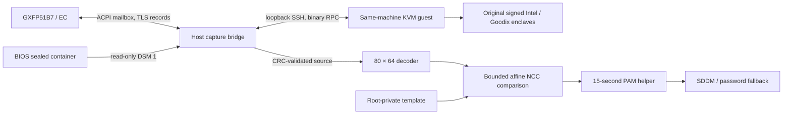

# Architecture and protocol

## Data path

The communication key is unsealed inside the original vendor enclave. SGX hardware keys bind unsealing to the same physical platform. The guest provides the compatibility environment for the signed legacy enclave and Intel launch flow.

## Hardware boundary

- ACPI device: `GXFP51B7:00`, namespace `\_SB.SPBA`.
- Reserved host mailbox: `0x40200000`, size `0x8000`, receive offset `0x1000`.
- DSM GUID: `cc58b68a-4479-4893-a8bb-961209db59e5`, revision 0.
- DSM 1 provides a 2048-byte buffer declaring an 885-byte sealed container. The host helper accepts only the validated container header and DMI model; its device mode is 0600.
- DSM 2 rings the EC doorbell through `acpi_call`.
- Sensor register ID: `0x2504`, ChicagoHS enumeration 12. The empty `0x90` response `e0 e1` is recorded as a separate query response.

The host transport checks DMI, ACPI presence, reserved resource bounds and exclusive access. Exclusive capture requires the diagnostic driver to be unloaded. The lock protects overlapping capture processes.

TLS uses the observed TLS 1.2 `PSK-AES128-CBC-SHA256` suite. The host forwards records; the original enclave performs cryptographic verification. After the handshake, the bridge submits the validated volatile 256-byte sensor configuration, requires acknowledgement `90 / 01 01`, then submits capture `20 / 01 00`. The configuration applies to the current capture session; firmware and persistent key state remain as provisioned.

The guest RPC header is three little-endian 32-bit words: magic `0x43505247`, operation and length/status. The bridge bounds record sizes, observes the handshake completion status and accepts the source only after the original component's CRC success and expected final plaintext length. Large mailbox records must be stable for 30 ms before being consumed.

## Image and frozen comparison

The CRC-validated plaintext has length 10573 bytes; exported source is 10560 bytes. Image source is 80 column slots of 132 bytes: 96 bytes of packed 12-bit pixels plus 36 zero-padding bytes. Four pixels occupy six bytes. The decoder validates zero padding and produces 5120 row-major pixels. A separate tightly packed 7680-byte representation is supported for offline analysis only.

The matcher subtracts each capture from its enrollment background, applies Gaussian filters with sigma 0.7 and 2, subtracts those results and crops four pixels per edge to obtain 56×72 values. Presence gates require mean drop at least 900 and ridge contrast at least 40. Matching requires overlap at least 1600 pixels and normalized correlation at least 0.86.

Reference rotations cover −24° through +24° in 3° increments. The three highest-scoring references are refined with angle offsets ±2° at 1° steps, axis scales `{0.94, 0.97, 1, 1.03, 1.06}` and shear `{−0.03, 0, 0.03}`. Translation is bounded to ±30 horizontal and ±24 vertical pixels. Transformed-image masks exclude interpolated padding. The original image decoder and affine matcher algorithms remain unchanged during repository cleanup.

## Privileges and authentication

The host PAM helper runs as root because it accesses the protected mailbox, sealed container and template. It accepts only the explicit PAM `user=` account, executes a fixed helper under isolated Python with a sanitized environment, suppresses capture output, disables core dumps and bounds the subprocess group to 15 seconds. Nonzero exits, signals and timeouts return authentication unavailable; the PAM configuration continues to the original password path.

The Python helper requires root-owned non-writable paths, a matching local username/UID, a finite template of the expected shape and the fixed v3 policy/threshold. Root, empty-password and password-locked accounts are rejected. SDDM account/password/session includes remain in place. Shell, nologin, environment and faillock prechecks precede the optional fingerprint branch. A successful fingerprint goes through `pam_faillock authsucc`; the one-module failure jump avoids relying on the expanded length of a PAM include.

QEMU runs as the dedicated non-root `gxfpvm` account. Its service uses an empty capability set, a read-only vendor share and restricted user networking through a loopback SSH port. Its service restricts device access to KVM and virtual EPC, protects the host filesystem and disables core dumps. The SSH client authenticates with its dedicated private key and pins the guest host identity.

The trusted computing base includes host root, the administrator-provided guest and the custom matcher. A forged fingerprint satisfying that matcher can be accepted. See [security scope](../SECURITY.md).
